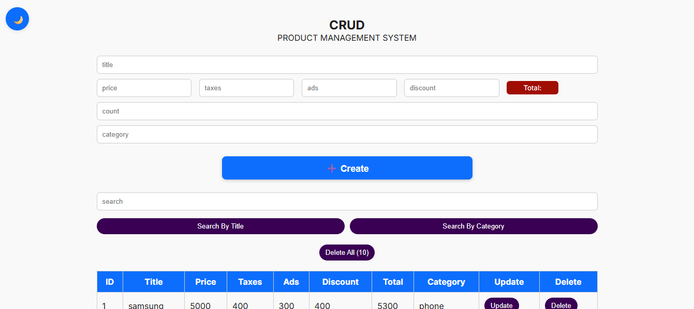
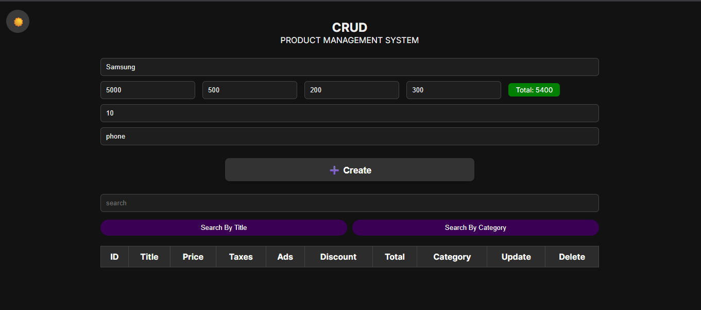

Product Management System (CRUD)

A simple and responsive CRUD (Create, Read, Update, Delete) application built using HTML, CSS, and JavaScript. This project allows users to manage product data efficiently with features like live total calculation, search by title/category, update and delete actions, and support for light/dark mode.

---

🚀 Features

- Add new products with detailed price breakdown
- Real-time total price calculation
- Search by title or category
- Update and delete individual entries
- Bulk delete all products
- Fully responsive UI (mobile/tablet/desktop)
- Persistent data storage using `localStorage`
- Light and dark mode support with local preference saving

---

📸 Screenshots

> <p float="left">
  
  
</p>

---

🛠 Technologies Used

- HTML5
- CSS3 (Flexbox, Responsive Media Queries)
- JavaScript (ES6+)
- Browser `localStorage`

---
💡 Installation & Usage

1. Clone the repository or download the files:
   ```bash
   git clone https://github.com/3laaerfan/product-management-system.git
   ```
2. Open `index.html` in your browser.
3. Start managing your products!

---

📂 Folder Structure

```
📁 Project Root
 ┣ 📁 CSS
 ┃ ┗ 📄 style.css
 ┃ 📁 Images
 ┃ ┗ 📄 dark.png
 ┃ ┗ 📄 light.png
 ┣ 📁 Script
 ┃ ┗ 📄 main.js
 ┣ 📄 index.html
```

---

📣 Author

- Developed by Alaa Erfan
- 💼 Upwork Profile: https://www.upwork.com/freelancers/~01195c61f8569575bf
